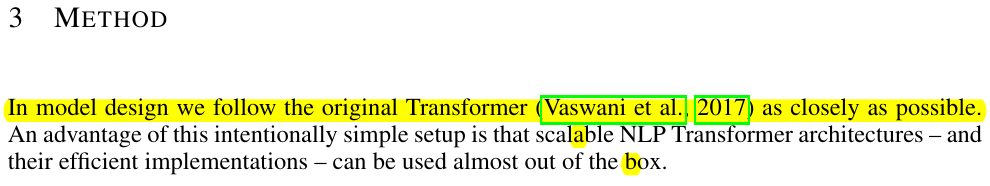

# Graph fusion experiment results
## Supported ViT by parasiting on existing BERT attention fusion
* From the architecture point ViT and BERT are pretty much the same, encoder-only, etc.

* No notices of attention mask in ViT paper, and from the graphs it is obvious that, unlike BERT, ViT does not use attention mask at all
Needed to make some changes in [attention fusion code](../onnxruntime/python/tools/transformers/fusion_attention.py) (constanly saying that python open source is pure trash)

* Different network graphs can be found [here](./graphs/)
